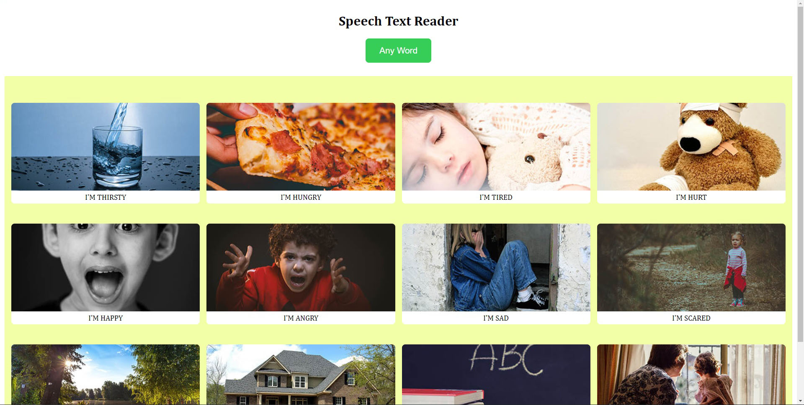

# Text to Read App
## For helping people with disabilities
## Super fun and cool Side Project using speechSynthesis & SpeechSynthesisUtterance() API

# Used **Vanilla JS** and vanilla CSS :)
## I enjoyed a lot doing this project .
## main idea from Sir [Brad Traversy](https://www.traversymedia.com/)
